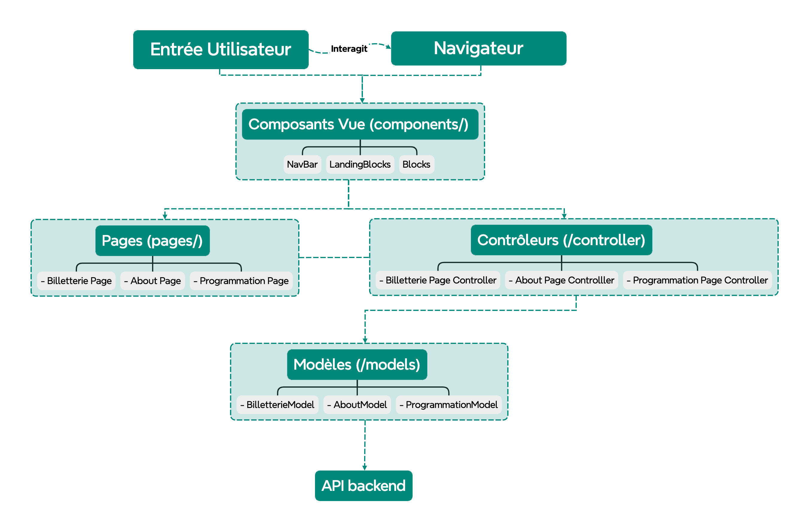

# Nation-Sound-Front

## Mon Projet Web - Frontend

Ce projet est une application web basée sur **Next.js**, développée selon l'architecture **MVC (Model-View-Controller)**. Il permet la gestion de différents blocs de contenu et l'interaction avec des API backend.

## Table des matières

- [Prérequis](#prérequis)
- [Installation](#installation)
- [Démarrage](#démarrage)
- [Structure du Projet](#structure-du-projet)
- [Architecture MVC](#architecture-mvc)
- [Explication du Code](#explication-du-code)
- [Déploiement](#déploiement)
- [Ressources](#ressources)

## Prérequis

- **Node.js** : version >= 18.0.0 <= 20.x.x
- **npm** : version >= 6.0.0

## Installation

1. Clonez le dépôt du frontend :

   ```bash
   git clone https://github.com/GabsBaquie/Nation-Sound-Front next-app
   cd next-app
   ```

2. Installez les dépendances :

   ```bash
   npm install
   ```

3. Configurez les variables d'environnement :

   Créez un fichier `.env` à la racine du projet et ajoutez les valeurs suivantes (ou celles qui conviennent à votre environnement) :

   ```env
   NEXT_PUBLIC_API_URL=http://localhost:1337
   ```

## Démarrage

Pour démarrer l'application en mode développement, exécutez :

```bash
npm run dev
```

Ensuite, ouvrez votre navigateur à l'adresse [http://localhost:3000](http://localhost:3000) pour voir le résultat.

## Structure du Projet

Voici un aperçu de la structure des dossiers du projet :

```
next-app/
├── .env
├── .eslintrc.json
├── .gitignore
├── .next/
├── app/
│   ├── globals.css
│   └── layout.tsx
├── components/
│   ├── animation/
│   ├── blocks/
│   ├── landingBlocks.tsx
│   └── NavBar/
├── controller/
│   ├── pagesController/
│   ├── slugController/
│   └── BlocksController.ts
├── models/
├── pages/
├── public/
├── tailwind.config.js
└── README.md
```

### Explication des principaux dossiers :

- **app/** : Contient les composants globaux tels que le layout et les fichiers CSS.
- **components/** : Stocke les composants réutilisables, organisés par catégorie.
- **controller/** : Contient les fichiers contrôleurs qui gèrent la logique métier de l'application.
- **models/** : Contient les modèles de données utilisés par l'application.

## Architecture MVC

### Modèles (Models)

Les modèles sont responsables de la gestion des données et de la logique métier. Ils sont définis dans le dossier `models`. Par exemple, le modèle `HeroBlockModel` contient les données pour le bloc Hero.

### Vues (Views)

Les vues, principalement situées dans le dossier `components`, sont responsables de l'affichage des données. Par exemple, `HeroBlock` est un composant qui affiche les informations provenant du modèle `HeroBlockModel`.

### Contrôleurs (Controllers)

Les contrôleurs gèrent les interactions entre les modèles et les vues. Ils sont définis dans le dossier `controller`. Par exemple, `HeroBlockController` contient la logique qui relie le modèle `HeroBlockModel` à la vue `HeroBlock`.

## Explication du Code

1. **Entrée Utilisateur** : L’utilisateur interagit avec l’application via le navigateur en naviguant et en cliquant sur des éléments.

2. **Composants Vue (components/)** :

   - Les composants situés dans le dossier `components/` affichent les données et gèrent l’interface utilisateur. Ils comprennent :
     - **NavBar** : Barre de navigation.
     - **LandingBlocks** : Composant principal pour afficher différents blocs de contenu.
     - **Map** : Composant pour afficher une carte.
     - **GenericCard** : Composant pour afficher des cartes génériques.

3. **Pages (pages/)** :

   - Les pages de l’application, situées dans le dossier `pages/`, utilisent les composants de vue pour afficher les différentes sections de l’application (ex. Billetterie, About, Programmation).

4. **Contrôleurs (controller/)** :

   - Les contrôleurs situés dans le dossier `controller/` gèrent les interactions entre les modèles et les vues. Ils récupèrent les données des modèles et les envoient aux composants pour l’affichage :
     - **BilletterieController** : Gère les données de billetterie.
     - **AboutController** : Gère les données de la page “About”.
     - **ProgrammationController** : Gère les données de la programmation.

5. **Modèles (models/)** :

   - Les modèles situés dans le dossier `models/` définissent la structure des données de l’application :
     - **BilletterieModel** : Modèle pour les données de billetterie.
     - **AboutModel** : Modèle pour les données de la page “About”.
     - **ProgrammationModel** : Modèle pour les données de la programmation.

6. **Base de données / API backend** :
   - Les modèles récupèrent les données à partir de la base de données ou d’une API backend (par exemple, via une API REST).



## Déploiement

Le déploiement de l'application peut se faire facilement sur la plateforme **Vercel** :

1. [Créez un nouveau projet sur Vercel](https://vercel.com/new).
2. Suivez les instructions pour connecter votre dépôt GitHub.
3. Vercel déploiera automatiquement l'application après chaque mise à jour du code.

Pour plus de détails, consultez la [documentation de Next.js sur le déploiement](https://nextjs.org/docs/deployment).

## Ressources

- [Documentation Next.js](https://nextjs.org/docs)
- [Tutoriel interactif Next.js](https://nextjs.org/learn)
- [Dépôt GitHub Next.js](https://github.com/vercel/next.js)
- [Dépôt GitHub Nation-Sound-Front](https://github.com/GabsBaquie/Nation-Sound-Front)
